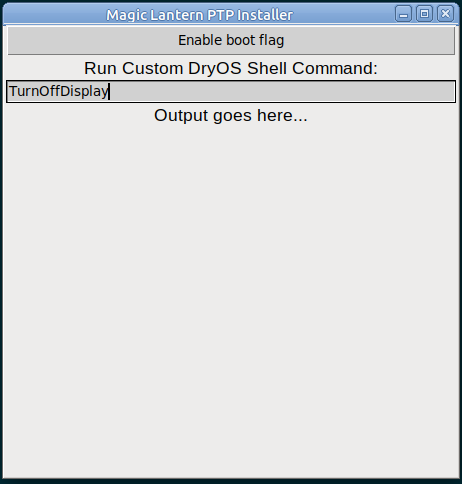

# mlinstall
A cross-platform Tkinter front-end for my modified version of the  
`sequoia-ptpy` library: https://github.com/petabyt/sequoia-ptpy  

**This is not guaranteed to work or not brick  
your camera. Use at your own risk**

# TODO:
Feel free to send a pull request.  
- [x] - Enable/Disable boot disk
- [x] - Execute DryOS shell commands
- [x] - Basic PTP functionality
- [ ] - Write EOS_DEVELOP flags to SD card
- [ ] - Download correct ML based on model and FW version (canon.py)
- [ ] - Fix code style? Not a Python expert here
- [ ] - RIIR

# Download
Download a pre-build binary:  
https://github.com/petabyt/mlinstall/releases/tag/0.1.0  

# Run from source
```
make setup
make
```


