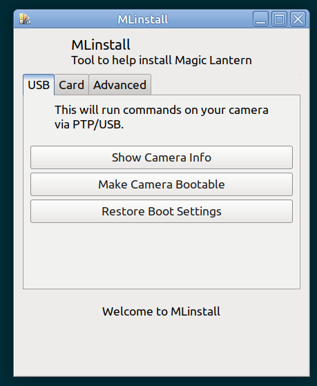

# MLinstall
A Windows/Linux app to assist with installing Magic Lantern.  
Download: https://github.com/petabyt/mlinstall/releases  



## Features
- Make camera bootable over USB (alternative to Magic Lantern's custom .FW files)
- Get firmware & build version, get shutter actuation count, other info
- Write memory card boot and script flags (FAT16/32/ExFAT)
- Clear card flags without reformattting

## Long-term roadmap
 - [x] Add shutter counter
 - [x] Display FW and internal build version
 - [x] MacOS port
 - [ ] Diagnostic + error reporting

All pull requests/issues are welcome.

## Linux Compilation
- Clone with `--recurse-submodules`.
- libui-ng is required - you can install it through https://github.com/petabyt/libui-cross
- Required packages: `sudo apt install libusb-dev gcc libgtk-3-dev`
```
make TARGET=l linux.out
```

## Windows Compilation
- Mingw is required: `apt install gcc-mingw-w64-x86-64`.
- libui-cross can be compiled and installed for cross-compilation on WSL/Linux
```
make TARGET=w mlinstall.exe
```

## MacOS Compilation
- Can be compiled in [darling](https://darlinghq.org) for x86_64
- libs: https://s1.danielc.dev/filedump/libs.tar.gz
- TODO: more info
- Does it work on M1?

Licensed under GNU General Public License v2.0.  
