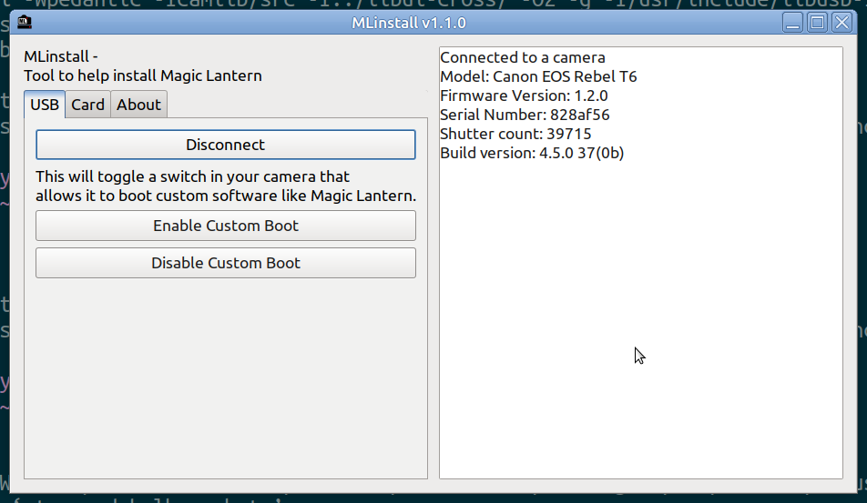

# mlinstall
A Windows/Linux app to help with installing Magic Lantern.  
Download: https://github.com/petabyt/mlinstall/releases  



## Features
- Enable/Disable boot disk (hopefully replacing custom encrypted firmware files)
- Basic PTP functionality (get firmware/model/serial info)
- Write EOS_DEVELOP and BOOTFLAG to card (Windows + Linux)
- Make card Canon Basic Scriptable
- Destroy card flags (without reformat)
- App Store: Downloads and installs modules on SD card

## TODO / HELP NEEDED:
 - Fuzz testing
 - Mac OS port, (don't have a modern one)
 - Improve the [user manual](MANUAL.md)

All pull requests/issues are welcome.  

## Linux Compilation
Required packages:  
- libusb-dev
- gcc
- libgtk-3-dev
```
make unix-gtk
```

For releases, staticx (`pip3 install staticx`) is used to  
convert dynamic executables to static. (similar to AppImage)  

## MacOS Compilation
Not ported to MacOS yet. The Python3-based version should work, see [python-stable](https://github.com/petabyt/mlinstall/tree/python-stable).  

## Windows Compilation
Cross compile for Windows, from Linux  
Some libs must be downloaded to provide  
the DLLs for the compiler and zip file.  
MinGW is required (`apt install gcc-mingw-w64-x86-64`)  

```
make win-gtk
```

Licensed under `GNU General Public License v2.0`.  
`ptpcam  (c)2001-2006 Mariusz Woloszyn <emsi@ipartners.pl>`  
This fork: Applied some research from https://github.com/petabyt/sequoia-ptpy  
into the [Magic Lantern fork of ptpcam](https://github.com/reticulatedpines/magiclantern_simplified/tree/dev/contrib/ptpcam).  
